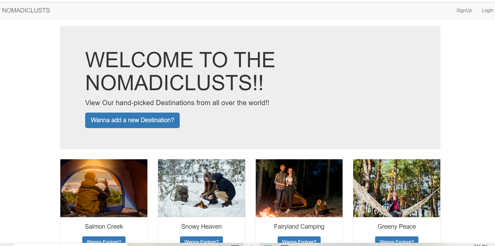

# NOMADICLUSTS

Nomadiclusts is basic blogging site.This is a simple full-stack project based on RESTful API(CRUD operations), made using express, nodejs(JavaScript) for backend and HTML, CSS, Bootstrap for frontend.The MongoDB ATLAS is used for the database requirements.

The user can make an account and explore different destinations posted by him and all the other users and can also amke comments under posts if he is loggedin.
